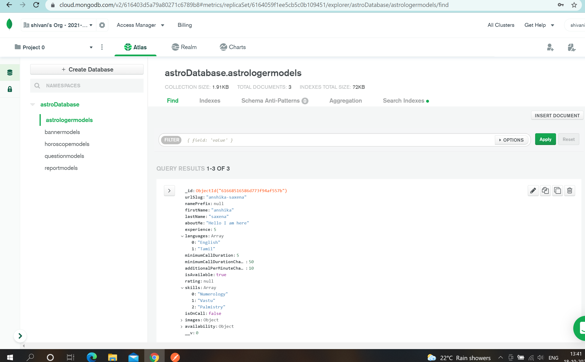

# AstroAPI
APIs for astrology application. Multiple APIs for Banners, Astrologers, Horoscope, Question and Report section of the astrology app.
The API runs on node.js server and uses MongoDb Atlas which is a cloud based database to store the data and schema is created uses Mongoose ORM. 
The APIs are capable of performing CRUD operation.

## Basic Features
1. Store, retrieve and delete data for Banner schemes.
2. Add, fetch, remove and modify data for astrologers.
3. Horoscope content for sunsigns can be created and fetched. The data for daily horoscope can be updated.
4. Questions can be added based on category.
    - All categories for question can be fetched.
    - Questions for a particular category can be fetched.
    - Suggested questions can be added to new categories.
    - New categories of questionaries can be created.
    - Category for a question can be removed.
5. Report data can be saved, fetched and deleted.
6. Cloud database is used so no need for local database.

## Preview Astrologer API
#### Astrologer data
</img> 

#### Banner data
</img> 

#### Horoscope data
</img> 

#### Question data
</img> 

#### Report data
</img> 

## How to install and run?
1. Clone this project
2. Start by installing npm if you don't have them already.
3. Add Mongodb Atlas cluster url along with credentials(username and password) in the config file of Mongoose.
4. Navigate to Project Directory by :
```
cd AstroAPI
```
5. run following commands :
```
npm install 
npm start or node index.js
```

## Setting up database in Mongodb Atlas
1. Create an account in MongoDb Atlas if not already.
2. Choose a plan and create cluster. (Free tier used for this application)
3. Setup connection security
    1. Add a connection IP address.
    2. Create a Database User. These credentials will be used in further steps.
 4. Choose a connection method to connect your application
    1. Select your driver and version
    2. Add your connection string into your application code (/config/mongoose.js). Eg.:
  ```
  mongodb+srv://Shivani:<password>@clusterastro.vyrzt.mongodb.net/myFirstDatabase?retryWrites=true&w=majority
  ```
5. Now the application is connected with mongodb cluster
  

## URL description and API end points
#### Base URL : `http://localhost:8000`
#### End Points :
1. `/api/astrologer/add` -> req.body (POST) : add new astrologer
2. `/api/astrologer/getData`  (GET) : fetch all astrologers and their data
3. `/api/astrologer/update/astrologerData` -> req.query.urlSlug & req.body (PUT) : changes the data of the astrologer based on astrologer's urlSlug
4. `/api/astrologer/delete` -> req.query.urlSlug (DELETE) : deletes the astrologer profile passed in request
5. `/api/banner/add` -> req.body (POST) : save new banner scheme
6. `/api/banner/fetch`  (GET) : fetches all the banner schemas
7. `/api/banner/delete` -> req.query.name (DELETE) : deletes the banner scheme with name provided in query params of request
8. `/api/horoscope/fetch`  (GET) : fetches data of all sunsigns present in horoscope' 
9. `/api/horoscope/save` -> req.body (POST) : saves the data for sunsigns in horoscope
10. `/api/horoscope/update` -> req.query.name & req.body.content (PUT) : to update the daily horoscope of sunsigns
11. `api/question/createQuestion` -> req.body (POST) : creates a question category along with data
12. `api/question/fetchQuestions`  (GET) : fetches all category questions
13. `api/question/category/get` -> req.query.name (GET) : fetches questions for the category name requested
14. `api/question/suggestion` -> req.query.name & req.body.suggestion (PUT) : add question suggestions for a question category
15. `api/question/remove` -> req.query.name (DELETE) : removes a category of questions
16. `api/report/create` -> req.body (POST) : creates a report entry
17. `api/report/fetch`  (GET) : fetches all the reports along with data
18. `api/report/delete` req.query.name -> (DELETE) : delete a report based on report name in the request

## Directory Structure and flow of The Code
This code follows MVC pattern and hence everything is differentiated and well managed:

`/routes` - containes all the routes. <br>
`/controller` - contains functions to connect to different routes. <br>
`/models` - to store data in db we need models. <br>
`/config` - contains config files for mongoose, passport or any other configs such as middlewares. <br>
